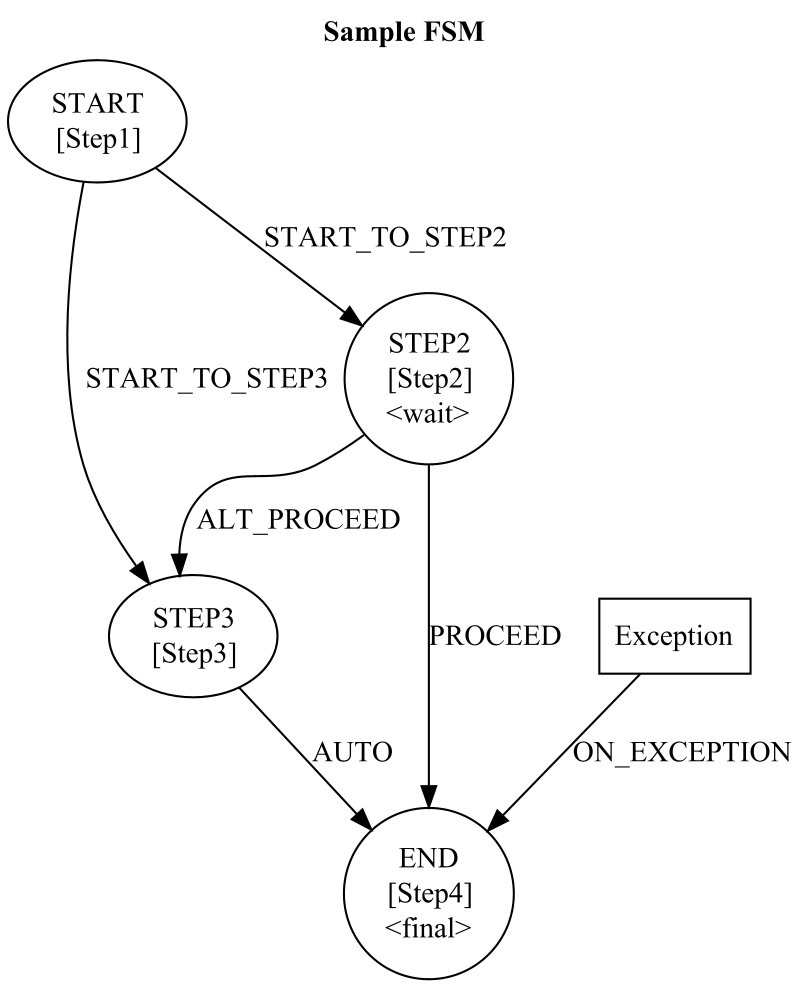

# Simple Finite State Machine (SimpleFSM)

SimpleFSM is a lightweight and customizable non-deterministic finite state machine library for Java, designed to simplify complex workflows and manage states effectively. The primary goal of this library is to provide developers with a simple yet powerful tool to implement and manage state machines within their applications.

## Background
Finite state machines (FSMs) are a powerful technique to manage the flow of control in an application. They allow you to define a set of states and transitions between those states, ensuring that the application behaves in a predictable and maintainable manner. SimpleFSM aims to provide an easy-to-use implementation of FSMs, which makes it ideal for managing complex workflows and handling state transitions in a more organized way.

## Features
- Simple and intuitive API for defining states, transitions, and events.
- Support for synchronous and asynchronous transitions.
- Built-in support for conditional transitions and auto-transitions.
- Configurable exception handling and error states.
- Trace mode for monitoring state transitions and debugging.
- Export and import of the state machine's state for persistence or communication between systems.
- Graphviz integration for visualizing the state machine.

## Getting Started
To use SimpleFSM in your Java project, simply include it as a dependency and start defining states and transitions. Here's a basic example to get you started:

Include dependency. For example in maven pom.
```
<dependency>
    <groupId>com.hexadevlabs</groupId>
    <artifactId>simple-finite-state-machine</artifactId>
    <version>1.0.0</version>
</dependency>
```

Sample Java code:
```java
import com.hexadevlabs.simplefsm.ProcessingData;
import com.hexadevlabs.simplefsm.ProcessingStep;
import com.hexadevlabs.simplefsm.SimpleFSM;
import simplefsm.*;

class ProcessingStep1() extends ProcessingStep {
    @Override
    protected void process(ProcessingData data) {
        // .. perform relevant processing
        nextState("state2"); // set conditionally the next step.
    }
}

public class MyFSM {

    public static void main(String[] args) {
        // Create a new SimpleFSM instance
        SimpleFSM fsm = new SimpleFSM.Builder()
                .state("state1", new ProcessingStep1())
                .conditional().goTo("state2")
                .conditional().goTo("state3")
                .and()
                .state("state2", new ProcessingStep2(), true) // Pause after step
                .on("event2").goTo("state3")
                .end()
                .finalState("state3", new ProcessingStep3())
                .build();

        // Initialize the FSM with a starting state and data
        ProcessingData data = new ProcessingData();
        fsm.start("state1", data);

        // Trigger events to drive the FSM
        fsm.triggerEvent("event2", data);

        // Check if the FSM has reached a final state
        if (fsm.isFinished()) {
            System.out.println("FSM has reached a final state: " + fsm.getFinalState().getName());
        }
    }
}
```

In this example, we define a simple FSM with three states and one events. 
Each state has a processing step associated with it, which can be any class that extends [ProcessingStep](src/main/java/com/hexadevlabs/simplefsm/ProcessingStep.java). 
The processing steps are responsible for performing the required actions in each state and setting the next state, if necessary.
For a more in depth demo take a look at [SimpleFSMDemo](https://github.com/felix-zaslavskiy/simple-finite-state-machine-samples/blob/main/src/main/java/demo/SimpleFSMDemo.java).

The [SimpleFSM.Builder](src/main/java/com/hexadevlabs/simplefsm/SimpleFSM.java) class provides a fluent API for defining states, transitions, and other FSM properties, making it easy to build complex state machines in a clean, readable way.

Using the **SimpleFSM.toGraphviz()** method you can generate a Dot notation graph representing the FSM. This text can be rendered in various ways such to a PNG file. An example of what it will look like is below:



## Future considerations
* Consider adding timeout handling for events.(seems complex)
* Should the state of FSM be represented as graph structure instead of Hashtable. probably needed for high perforce.
* For a completed FSM draw a graph that shows the path taken by that execution. Seems like nice idea for debugging.
* For additional features need to see what real world use-cases demand.

## Contributing
We welcome contributions to SimpleFSM! If you'd like to contribute, please fork the repository, make your changes, and submit a pull request.

## Version history
* 1.0.1 Make ProcessingData Serializable
* 1.0.2 Add setProcessingStep() to State class.

## License
SimpleFSM is released under the **Apache Version 2.0**
